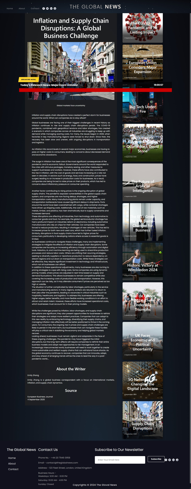
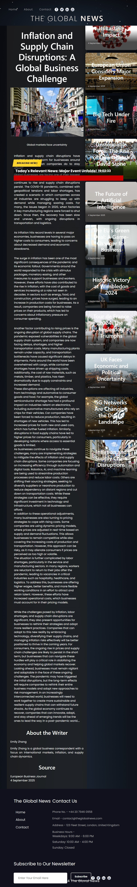
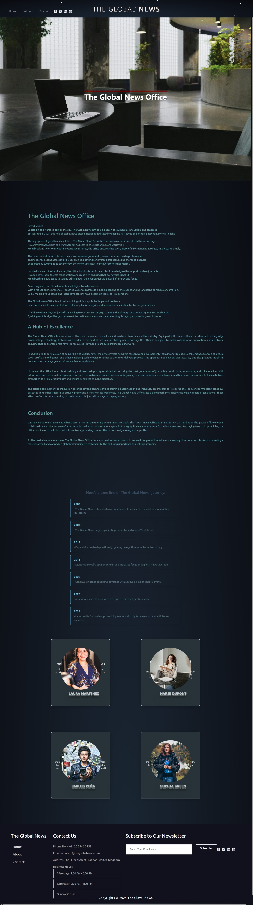
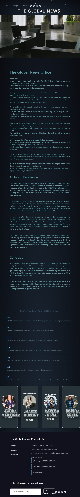
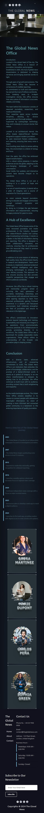
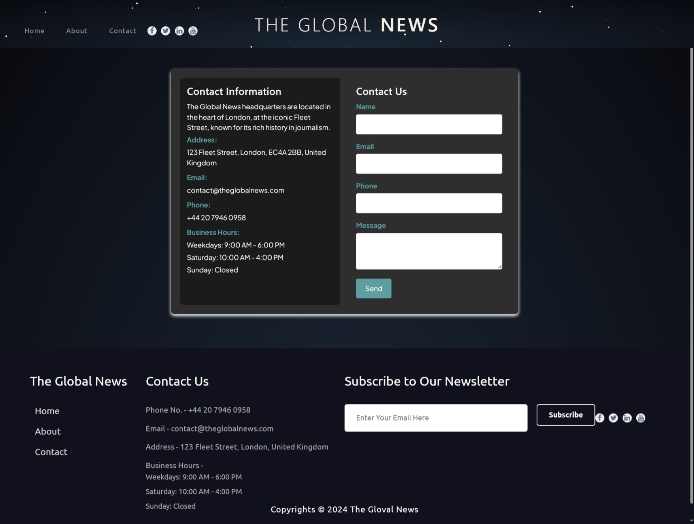
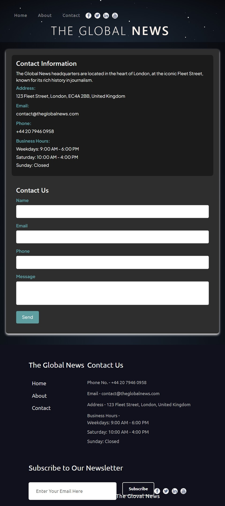
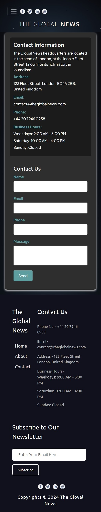
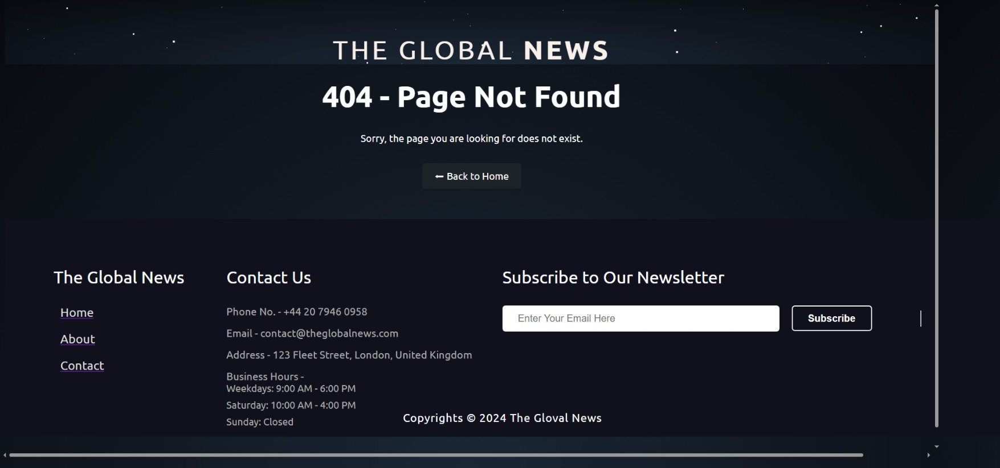
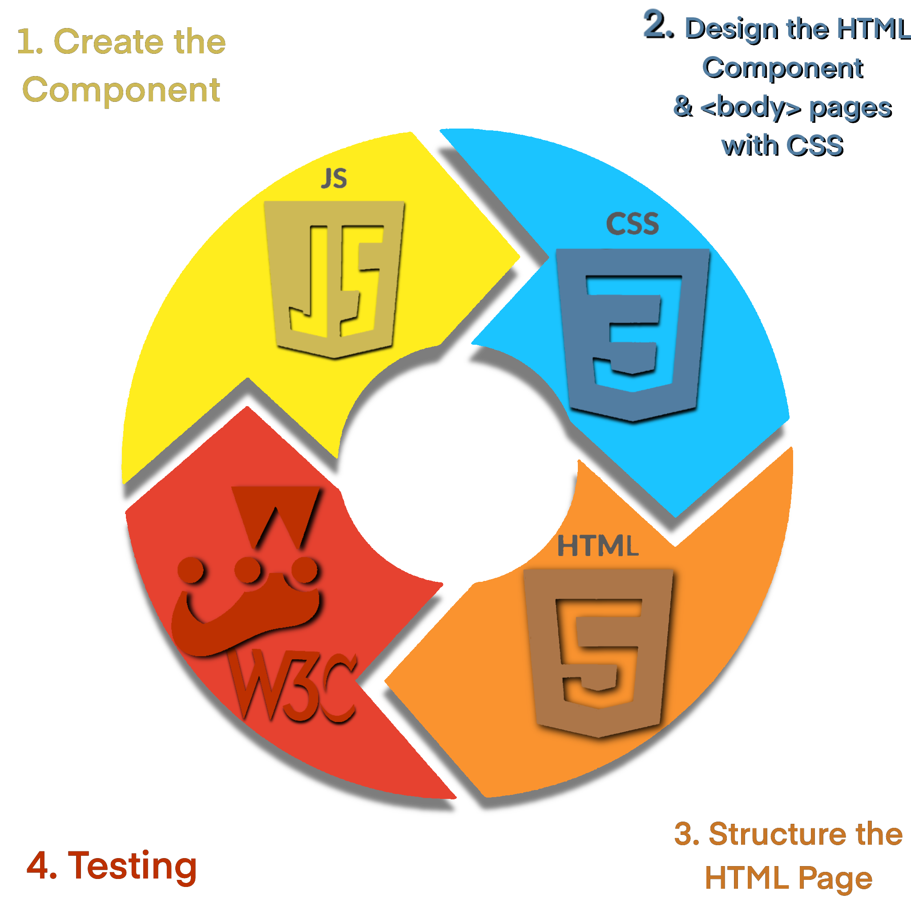

# The Global News
 <br>
**The Global News** is a fictional digital news platform that promotes independent journalism, free from corporate, political, or financial influence. This project showcases a responsive website that organizes news into various categories (sports, politics, technology, and business) while maintaining an accessible and scalable structure.
## User Stories

As a user:

- Navigate between news categories easily so I can find relevant information quickly.  
- Access the site on my phone and still read all content without issues.  
- Open each article in a dedicated page to focus only on the content.  
- Stay updated with a Breaking News section to be informed live.  

### Repository and Live Project  

You can find the source code for **The Global News** in the GitHub repository below:  
- **Repository**: [Global News GitHub Repository](https://github.com/ToniEstarlich/Global-News)  

The live version of the project is accessible here:  
- **Live Project**: [The Global News](https://toniestarlich.github.io/the-global-news.github.io-/)  

---
## Table of Contents
1. [The Global News](#the-global-news)
3. [Project Structure](#project-structure)
4. [Tecnologies used](#technologies-used)
2. [Wireframes](#wireframes)
5. [Development Process](#development-process)
6. [Problem & Resolutions](#problem-and-resolution)
---

## 🚀 Project Vision

Global News embodies the ideals of journalistic freedom and technology as a means to ensure the liberty of information. The platform is designed to deliver comprehensive, unbiased, and real-time updates, setting a standard for transparent and ethical reporting.

---

## 🌟 Features

1. **Responsive Design**  
   The site adapts seamlessly to various devices, including desktops, tablets, and smartphones.

2. **Component-Based Structure**  
   A modular approach to building reusable components for better scalability and maintainability.

3. **Dynamic Sections**  
   Each news category (sports, politics, technology, and business) is designed with dedicated HTML pages and supporting JSON data.

4. **Interactive Features**  
   Dropdown menus, slide cards, and subscription/contact forms enhance user interaction.

5. **About & Contact Pages**  
   Detailed information about the fictional newsroom, including journalist profiles and contact forms.

---

# 🖥️ Screenshots

## Home
| Desktop View | Tablet View | Mobile View |
|--------------|-------------|-------------|
|  |  |  |

## The New
| Desktop View | Tablet View | Mobile View |
|--------------|-------------|-------------|
|  |  |  |

## About
| Desktop View | Tablet View | Mobile View |
|--------------|-------------|-------------|
|  |  |  |

## Contact
| Desktop View | Tablet View | Mobile View |
|--------------|-------------|-------------|
|  |  |  |

---
## Design Style

The project features a sleek, modern design with a dark theme and smooth gradients to create an immersive user experience.

### Key Design Features:

- **Background**: The body background uses a *radial gradient* that transitions from a dark blue (#1B2735) at the bottom to a deep black (#090A0F) at the top, providing a subtle, immersive effect.
- **Font**: The project uses the *Ubuntu* font-family, which is sans-serif and modern, ensuring readability and a clean, minimalist look.
- **Text Colour**: The text colour is set to white (#fff), offering strong contrast against the dark background for clear visibility.
- **Layout**: The body is set to take up the full width of the screen and has a minimum height of 100vh (viewport height), ensuring that content stretches to fill the entire screen. The vertical overflow is set to *overlay*, allowing smooth scrolling without additional space at the edges.

 ### Design Resources  
All pictures used in this project were sourced from [Pexels](https://www.pexels.com/), a platform offering high-quality, royalty-free images. These images were carefully selected to enhance the visual appeal and user experience of the web application.  


### Additional Styling:

- **Lines**: Horizontal lines are styled with a height of 2px and a grey colour. This subtle element helps to separate sections of content visually.
  
```css
.line {
    height: 2px;
    border-width: 0;
    color: rgb(255, 255, 255);
    background-color: gray;
}
```
### ⚠️ 404 Page

- A `404.html` page was implemented to display a user-friendly error message when the user tries to access a non-existent page.
- It includes a navigation button to return to the Home page (`index.html`) without the need to use the browser's back button.
---
##  Project Structure 
# 🗂️
```bash
/The Global News
    /_mocks_
        jquery.js
    /_tests_
        header.test.js
        Breaking-news.test.js
        1item_slide_card.test.js
        navbar.test.js
        footer.test.js
        content.test.js
        cards.test.js
        business-news.test.js
        sport-news.test.js
        technology-news.test.js
        politics-news.test.js
        dropdown.test.js
        slide-card.test.js
        social-buttoms.test.js
        contact-form.test.js
        cards-jornalis.test.js
        history-about.test.js
        sport-news.test.js
        politics-news.test.js
        tech-news.test.js
        business-news.test.js
         
    /assets
       /images
          business1.jpg
          business2.jpg
          business3.jpg
          sport1.jpg
          sport2.jpg
          sport3.jpg
          tech1.jpg
          tech2.jpg
          tech3.jpg
          politics1.jpg
          politics2.jpg
          politics3.jpg
          the-office.jpg
          carlos.jpg
          laura.jpg
          marie.jpg
          sophia.jpg
       /wireframes
          about-wireframe.png
          form-wireframe.png
          home-wireframe.png
          news-wireframe.png
       /wireframes_components
          about_header_component.png
          card_jornalist_component.png
          contact_form_component.png
          dropdown_component.png
          footer_component.png
          header_component.png
          mix_cards_component.png
          navbar_component.png
          news_component.png
          news_section_component.png
          slide_card_component.png
          social_buttoms_component.png
          the_office_component.png
          time_line_component.png
        /screenshots
          ipad-mini.jpeg
          pc-screen.jpeg
          smartphone.png     
    /components
        header.js
        Breaking-news.js
        1item_slide_card.js
        navbar.js
        footer.js
        content.js
        cards.js
        business-news.js
        sport-news.js
        technology-news.js
        politics-news.js
        dropdown.js
        slide-card.js
        social-buttoms.js
          /Contact-component
            contact-form.js
          /About-component
            cards-jornalis.js
            history-about.js
          /news-components
            sport-news.js
            politics-news.js
            tech-news.newsjs
            business-news.js
    /css
        about-header.css
        Breaking-news.css
        cards-journalist.css
        navbar.css
        footer.css
        cards.css
        contact-form.css
        dropdown.css
        social-buttoms.css
        header.css
        slides-card.css
        styles.css
        subscription.css
        the-news.css
        the-office.css
        time-line.css
    /pages
        /sports-news
            sport1.html
            sport2.html
            sport3.html
        /politics-news
            politics1.html
            politics2.html
            politics3.html
         /tech-news
            tech1.html
            tech2.html
            tech3.html
        /Business-news
            Business1.html
            Business2.html
            Business3.html
        /success
            subscription.html
            send-contact.html
        contact.html
        about.html
    /node_modules
    .babelrc   
    index.html
    jest.setup.js
    package-lock.json
    package.json
    README.md
```

---

## Technologies Used
# 📚 

The project utilises a combination of modern frontend technologies and tools to create an interactive and responsive news web app. Below is a list of the main technologies used:

### Frontend Technologies:

- **HTML5**  
  HTML5 provides the basic structure of the web pages, including semantic elements like `<header>`, `<footer>`, and `<nav>`, helping with both the accessibility and SEO of the site.  
  [HTML5 Documentation](https://developer.mozilla.org/en-US/docs/Web/HTML)

- **CSS3**  
  CSS3 is used for styling the components of the web app. Features like radial gradients, flexbox, and CSS animations contribute to a clean, responsive design.  
  [CSS3 Documentation](https://developer.mozilla.org/en-US/docs/Web/CSS)

- **W3.CSS**  
W3.CSS, a lightweight and responsive CSS framework by W3Schools, was used to style and structure the project. W3.CSS's built-in classes helped streamline layout, typography, and UI elements efficiently.  
[W3.CSS Website](https://www.w3schools.com/w3css/)

- **Bootstrap**  
Bootstrap, a popular front-end framework, was used to design a responsive and visually appealing interface for the project. Its prebuilt components and grid system allowed for efficient layout structuring, ensuring consistency across different screen sizes.   
[Bootstrap Website](https://getbootstrap.com/)  


- **JavaScript**  
  JavaScript is used to create dynamic behaviour within the web app, such as updating breaking news in real-time and handling user interactions.  
  [JavaScript Documentation](https://developer.mozilla.org/en-US/docs/Web/JavaScript)

- **JQuery**  
  JQuery simplifies HTML document traversal, event handling, and animations, allowing for efficient DOM manipulation and interaction within the web app.  
  [JQuery Documentation](https://jquery.com/)

- **JSON**  
  JSON is used for data handling, allowing the app to efficiently store and retrieve information, particularly for dynamic content like the news articles.  
  [JSON Documentation](https://www.json.org/json-en.html)

- **Google Fonts**  
  Google Fonts is used for enhancing typography within the web app, offering a wide selection of fonts for improved readability and design aesthetics.  
  [Google Fonts Website](https://fonts.google.com/)

- **Font Awesome**  
  Font Awesome is used to integrate vector icons, providing scalable icons that enhance the app’s user interface with visually appealing and easy-to-use icons.  
  [Font Awesome Website](https://fontawesome.com/)

- **Jest**  
  Jest is a testing framework used for unit and integration testing in the project. It ensures the functionality and reliability of various components, such as dynamically updating news, clock functionality, and animations.  
  [Jest Documentation](https://jestjs.io/)

- **Procreate**  
  Procreate, a powerful digital illustration tool, was used to sketch and create wireframes for the design of the app. As an experienced illustrator, Procreate helped me quickly visualise and create the UI/UX layout before moving on to the development stage.  
  [Procreate Website](https://procreate.art/)


---

## Wireframes

The project consists of four main wireframes: **Home**, **About**, **News**, and **Contact**. Each wireframe is designed to serve a specific purpose within the application. Below is an overview of each wireframe and its components.

## Design Iteration 

- The project started with wireframes for the home page and the contact page. The header with the navbar caused some issues at the beginning, but I eventually found satisfactory solutions.  
- The home page wireframe showed a grid of categories, which is almost identical to the final version, with responsive adjustments to make the design adapt to both mobile and desktop.  
- The contact page wireframe was very basic. In the final design, I added a styled form with appropriate fields to improve usability.  
- Overall, the final implementation stayed close to the wireframes but included adjustments for better responsiveness and styling.  
- During the creation of the home page, I added a **Breaking News** feature that was not part of the original wireframes, and integrated it into both the home page and the news pages.  


### 1. Home Wireframe
<br>

The **Home** wireframe serves as the landing page for the project. It contains a navigation bar, a main header, sections for different categories of news (Politics, Business, Technology, and Sports), as well as a carousel of news headlines and a breaking news section. The layout is divided into various components that are reusable throughout the project.

**Key Sections:**
- **Navbar**: Contains links for navigation.
- **Header**: Displays the project’s header information.
- **News Sections**: Categories of news such as Politics, Business, Technology, and Sports.
- **Cards Slider**: A carousel of selected news.
- **Breaking News**: A section at the bottom of the screen that shows the most important current events.
- **Footer**: Contains the project’s footer content.

### 2. About Wireframe
<br>

The **About** wireframe introduces the project, including a timeline of its journey and the people behind it. The content is organized into sections using custom components for headers, journalist cards, and a timeline.

**Key Sections:**
- **Navbar**: The navigation menu is always accessible.
- **About Header**: Displays the introduction or description of the project.
- **Timeline**: A timeline of the project’s journey.
- **Journalist Cards**: A section showcasing journalists contributing to the news.
- **Footer**: Contains the footer with necessary links.

### 3. News Wireframe
<br>

The **News** wireframe displays an individual news article along with additional news components like sliders and mix cards. Each news piece is structured using custom components for different types of content.

**Key Sections:**
- **Navbar**: Navigation bar for easy access to different parts of the site.
- **About Header**: Includes a brief description related to the current news section.
- **News Content**: Displays detailed content about the news (e.g., Politics).
- **Slider & Mix Card**: Shows additional or related news.
- **Breaking News**: Displays the most urgent news at the bottom.
- **Footer**: Contains the footer section.

### 4. Contact Wireframe
<br>

The **Contact** wireframe contains a contact form that allows users to get in touch with the project team. It also includes the usual navigation and footer components.

**Key Sections:**
- **Navbar**: Navigation bar for site-wide access.
- **About Header**: Introduction to the contact section.
- **Contact Form**: A form for users to fill out and contact the team.
- **Footer**: Footer information.

### Wireframe Design Tools

These wireframes were designed using **Procreate**, a digital illustration application. It allowed for quick and efficient sketching and planning of the layout and structure of the website before proceeding with the development. Procreate's intuitive interface enabled me to visualise the design concepts effectively and iteratively.

---
## Development Process
<br>

The creation of the web app followed a structured and organised process to ensure modularity, reusability, and quality across all components. Below are the steps that were followed:

### 1. Create the Component
Each feature of the web app is developed as a reusable custom HTML component using JavaScript. These components encapsulate their own logic and can easily be integrated into multiple pages. 

#### Example of a Component:  
```javascript
class TheComponent extends HTMLElement {
  connectedCallback() {
    const newsData = {
      "jsonText": [
        {
          "TheText": "random text",
        }
      ]
    };

    this.innerHTML = `
      <div class="news">
        <p>${newsData.jsonText[0].TheText}</p>
      </div>
    `;
  }
}

window.customElements.define('the-component', TheComponent);
```
### 2. Design the HTML Component & `<body>` Pages with CSS
After defining the functionality of a component, a corresponding CSS file is created to style it. Separating the logic and presentation ensures the project is easier to maintain, scale, and debug.

#### 1. `style.css` – Global Stylesheet
This stylesheet applies general styles for the HTML pages, ensuring consistency and resetting browser defaults.

```css
/* General Reset */
* {
  margin: 0;
  padding: 0;
  box-sizing: border-box;
}

/* Body Styling */
body {
  font-family: 'Arial', sans-serif;
  line-height: 1.6;
  background-color: #f9f9f9;
  color: #333; /* Correct spelling of "colour" */
  overflow-x: hidden;
}
```
#### 2. `TheComponent.css` – Component-Specific Styles
Each custom component is styled in its own CSS file to ensure modularity. Below is an example of styling for a news card component:

```css
.news {
  padding: 20px; /* Add inner spacing */
  gap: 16px; /* Space between child elements */
  background-color: #fff; /* Light background for contrast */
  border: 1px solid #ddd; /* Subtle border */
  border-radius: 8px; /* Smooth corners */
  box-shadow: 0 4px 6px rgba(0, 0, 0, 0.1); /* Light shadow for depth */
}
```
**Example Workflow:**

1. Define the component's structure and functionality in JavaScript.
2. Write a separate CSS file to style the component's layout, colours, and behaviour.
3. Link the component's CSS file to the global styles or import it where needed.

---

### 3. Structure the HTML Page
The application is divided into different HTML pages, such as **Home**, **About**, **News**, and **Contact**, each using the custom components created in Step 1. The structure of each page is carefully designed to provide a user-friendly interface while adhering to semantic HTML standards.

**Example of HTML Structure:**
```html
<head>
  <!--css styles-->
  <link rel="stylesheet" href="../css/navbar.css">
  <link rel="stylesheet" href="../css/about.css">
  <link rel="stylesheet" href="../css/the-component.css">
  <link rel="stylesheet" href="../css/footer.css">
</head>

<body>
  <nav>
    <navbar-component></navbar-component>
  </nav>
  <header>
    <header-component></header-component>
  </header>
  <section>
    <the-component></the-component>
  </section>
  <footer>
    <footer-component></footer-component>
  </footer>
 
  <!--Including the components JavaScript-->
  <script src="../components/navbar.js"></script>
  <script src="../components/header.js"></script>
  <script src="../components/the-component.js"></script>
  <script src="../components/footer.js"></script>
</body>
```
### 4. Testing
To ensure quality and functionality, the following testing processes were conducted:

- **Jest**: Used for unit testing custom components to verify their behaviour and logic.
- **W3C Validator**: Used to validate the HTML and CSS for compliance with web standards, ensuring cross-browser compatibility and accessibility.

This systematic approach ensures that the web app is modular, visually appealing, and meets high standards of qualitys

---
# The Component Development Process 
## Creating the Component
To create the component, follow these steps:
Each component in the project follows the same basic structure. Here’s how to create a new component:

## 1. Create the Component Class
Start by creating a class that extends `HTMLElement`. The name of the class should match the component name (e.g., `headerComponent` for the header, `footerComponent` for the footer)..

```js
class TheComponent extends HTMLElement {
  connectedCallback() {
    // Insert your code to create dynamic content here
  }
}
``` 
## 2. Define the Data (JSON)
Inside the `connectedCallback()` method, define the data that the component will use. This could be an array or an object.

```js
const data = [
  {
    "property1": "value1",
    "property2": "value2",
    // More properties as needed
  },
  // Add more items if needed
];
``` 
## 3. Generate the HTML Dynamically
Use the data to dynamically generate the HTML for the component. Loop through the data and create individual items.

```js
const itemsHTML = data.map(item => `
  <div class="item">
    
    <div class="content">
      <h2 class="title">${item.property1}</h2>
      <p class="description">${item.property2}</p>
      <a href="${item.url}" class="read-more-button"><button>Read More</button></a>
    </div>
  </div>
`).join('');
``` 
## 4. Set the Inner HTML
Insert the generated HTML inside the component using `this.innerHTML`.
```js
this.innerHTML = `
  <div class="the-component-container">
    ${itemsHTML}
  </div>
`;
``` 
## 5. Add Event Listeners (if necessary)
If your component includes interactive elements (like buttons or sliders), add event listeners to handle user interactions. For example, if you have "Next" and "Previous" buttons:

```js
function activate(e) {
  const items = document.querySelectorAll(".item");
  if (e.target.matches(".next")) {
    document.querySelector(".slider").append(items[0]);
  }
  if (e.target.matches(".prev")) {
    document.querySelector(".slider").prepend(items[items.length - 1]);
  }
}

document.addEventListener("click", activate, false);
``` 
## 6. Set Up Automatic Behaviour (if necessary)
For components like sliders, you might want to implement automatic behaviour, such as auto-changing slides. This can be done using `setInterval`:
```js
setInterval(() => document.querySelector(".next").click(), 4000);

``` 
## 7. Register the Component
Finally, register the component with a unique tag name for it (e.g., `<the-component>`).
```js
window.customElements.define('the-component', TheComponent);
``` 
---
## Git & Version Control

Git was used throughout the development to manage versions of the project.

- I committed regularly after finishing small features (e.g., creating the business section, adding navigation bar, fixing CSS issues).  
- Commit messages were descriptive to make the progress clear.  
- Since the project was built with independent JavaScript components, I often followed a trial-and-error approach, experimenting and refining before merging changes.  


---
## 🔨 How to Run the Project

1. Clone the repository from GitHub:
```bash
   git clone https://github.com/ToniEstarlich/Global-News
```
## Deployment Procedure (GitHub Pages)

1. **Push your project to GitHub**

```bash
git init
git add .
git commit -m "Initial commit"
git branch -M main
git remote add origin https://github.com/ToniEstarlich/Global-News.git
git push -u origin main
```
## Enable GitHub Pages

1. Go to **Settings → Pages** in your repository.
2. Set **Source** to `main` branch and folder `/root`.
3. Click **Save**.

## Access Your Website

After a few minutes, your website will be live at:

[https://ToniEstarlich.github.io/Global-News/](https://ToniEstarlich.github.io/Global-News/)

## Update the Website

To update your live website, simply commit and push changes to GitHub:

```bash
git add .
git commit -m "Update site"
git push
```

---

# Problem and resolution
---
### Problem: Unable to Push Changes Due to Remote Conflicts

While attempting to push changes to the remote repository, the following error occurred:

### Resolution

The issue occurred because there were changes on the remote repository that were not present locally. To resolve this:

1. **Pulled the latest changes** from the remote repository to synchronize the local branch with the remote one:

```bash
git pull origin master
```

### Resolved Merge Conflicts

During the pull process, merge conflicts appeared. After editing the conflicted files, they were staged and committed with the following commands:

```bash
git add .
git commit -m "Resolved merge conflicts"
```
### Pushed Changes to Remote Repository

After resolving the merge conflicts and committing the changes, the updates were pushed back to the remote repository with the following command:

```bash
git push origin master
```
### Synchronization of Local and Remote Repositories

This process ensured that both the local and remote repositories were synchronized, resolving the issue and allowing for a successful push.

--- 
 ## HTML and CSS Validation

### W3C HTML Validation
The HTML code was validated using the [W3C HTML Validator](https://validator.w3.org/nu/). During validation, I reviewed the following:
## Fixing Fatal Error in HTML Validation  

### **Problem:**  
When validating the HTML file with the W3C Validator, the following **fatal error** appeared:  

```
Fatal Error: Cannot recover after last error. Any further errors will be ignored.

From line 38, column 1; to line 38, column 7

↩</head>↩<title>The Gl
```
❌ Incorrect Structure **(causes error):**
```html
<head>
    <meta charset="UTF-8">
    <meta name="viewport" content="width=device-width, initial-scale=1.0">
</head>

<title>The Global News</title> <!-- ❌ This should be inside <head> -->

<body>
```

### **Cause of the Error:**  
The `<title>` tag was placed **outside the `<head>` section**, which breaks the document structure and causes the validation to fail.  

### **Solution:**  
Move the `<title>` tag inside the `<head>` section:  

#### ✅ **Correct Structure:**
```html
<head>
    <meta charset="UTF-8">
    <meta name="viewport" content="width=device-width, initial-scale=1.0">
    
    <title>The Global News</title>  <!-- ✅ Title placed correctly inside <head> -->

    <!-- Other meta tags and stylesheets -->
</head>
```
## Result After Fixing  

- The W3C Validator no longer shows the **Fatal Error**.  
- The HTML document structure is now **correct**.  
- The page loads without **structural issues** in all browsers.  


### W3C CSS Validation
The CSS code was validated using the [W3C CSS Validator](https://jigsaw.w3.org/css-validator/validator). During validation, I reviewed the following:

# CSS Fixes for `cards-journalist.css`

## Issue 1: Invalid Negative `gap` Value in `.row`
- **Error:** Negative values are not allowed for `gap` in CSS.
- **Fix:** Change `gap: -60px;` to `gap: 0;` or adjust spacing using `margin-top`.

### **Before:**
```css
.row {
    gap: -60px; /* ❌ Invalid */
}
```
### After:
```css
.row {
    gap: 0; /* ✅ Valid */
}
```
If reducing spacing is necessary, use:
```css
.row {
    margin-top: -60px; /* Moves content upwards */
}
```
---
## Issue 2: Identical `color` and `background-color` in `.card`
**Error:** The .card element has the same color and background-color, making text unreadable.
Fix: Adjust either color or background-color to improve contrast.
### Before:
```css
.card {
    color: #bfc9cd;
    background-color: #bfc9cd; /* ❌ Text blends with background */
}
```
### After:
```css
.card {
    color: #273338; /* ✅ Darker text */
    background-color: #bfc9cd;
}
```
Alternatively, you can use:
```css
.card {
    color: white;
    background-color: #bfc9cd;
}
```
---
## Test Results

All tests passed successfully, confirming the functionality of the `aboutHeaderComponent`.

---
## Jest Testing

The project was thoroughly tested using Jest to ensure that all components function correctly. A total of **22 components** were tested, covering various aspects of the application, including dynamic content rendering, user interactions, and responsive behaviours.

The project relies on `Node.js` and `Jest` for testing. Two important files, `package.json` and `package-lock.json`, are used to manage the dependencies and the environment for the project.

### package.json
The `package.json` file is a fundamental part of the Node.js ecosystem. It holds metadata about the project, such as the project's name, version, scripts, and dependencies. For this project, it is used to specify the Jest testing framework as a dependency and to define the testing script to run tests.

The `package.json` file includes:

- **Dependencies**: This includes Jest, which is used to run the unit and integration tests for the components.
- **Scripts**: Common commands to run the project, such as `npm test` to run the tests using Jest.

You can find the `package.json` file in the root directory of the project.

### package-lock.json
The `package-lock.json` file is automatically generated when you run `npm install`. It locks the versions of the dependencies to ensure that the project works the same way across different environments. It helps to maintain consistent and reliable installations of dependencies.

The `package-lock.json`:

- Ensures that the exact same versions of dependencies are installed on every machine that clones the project.
- Helps with dependency management by preventing any unintended updates or breaking changes when installing dependencies.


### Key Tests Included:
- **Component Structure**: Ensured that each component rendered its expected structure, including dynamic elements like news lists and clocks.
- **State Updates**: Verified that components like the clock and breaking news list updated in real-time as expected.
- **CSS and Animation**: Tested animation durations and ensured they were set correctly, alongside component styling.
- **Error Handling**: Checked for correct behaviour when missing or incorrect data was provided.


All tests passed successfully, ensuring the components are working as expected.

---
