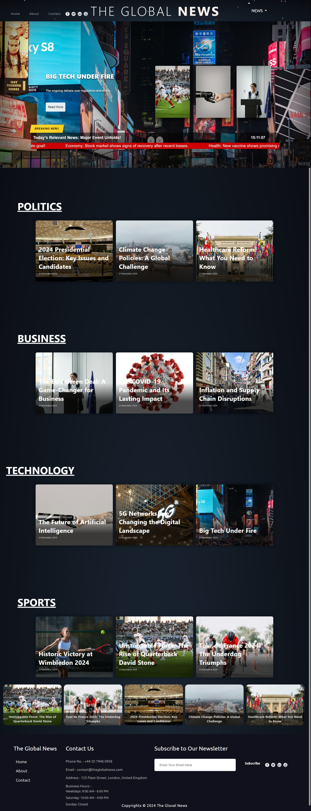

# Global News

**Global News** is a fictional digital news platform that promotes independent journalism, free from corporate, political, or financial influence. This project showcases a responsive website that organizes news into various categories (sports, politics, technology, and business) while maintaining an accessible and scalable structure.

---

## 🚀 Project Vision

Global News embodies the ideals of journalistic freedom and technology as a means to ensure the liberty of information. The platform is designed to deliver comprehensive, unbiased, and real-time updates, setting a standard for transparent and ethical reporting.

---

## 🌟 Features

1. **Responsive Design**  
   The site adapts seamlessly to various devices, including desktops, tablets, and smartphones.

2. **Component-Based Structure**  
   A modular approach to building reusable components for better scalability and maintainability.

3. **Dynamic Sections**  
   Each news category (sports, politics, technology, and business) is designed with dedicated HTML pages and supporting JSON data.

4. **Interactive Features**  
   Dropdown menus, slide cards, and subscription/contact forms enhance user interaction.

5. **About & Contact Pages**  
   Detailed information about the fictional newsroom, including journalist profiles and contact forms.

---

## 🖥️ Screenshots

###  **PC Screen**  **iPad Mini**  **Smartphone**
   

---

## 🗂️ Project Structure

/project-folder
    /components
        header.js
        Breaking-news.js
        1item_slide_card.js
        navbar.js
        footer.js
        content.js
        cards.js
        business-news.js
        sport-news.js
        technology-news.js
        politics-news.js
        dropdown.js
        slide-card.js
        social-buttoms.js
          /Contact-component
            contact-form.js
          /About-component
            cards-jornalis.js
            history-about.js
          /news-components
            sport-news.js
            politics-news.js
            tech-news.newsjs
            business-news.js
    /css
        about-header.css
        Breaking-news.css
        cards-journalist.css
        navbar.css
        footer.css
        cards.css
        contact-form.css
        dropdown.css
        social-buttoms.css
        header.css
        slides-card.css
        styles.css
        subscription.css
        the-news.css
        the-office.css
        time-line.css
    /pages
        /sports-news
            sport1.html
            sport2.html
            sport3.html
        /politics-news
            politics1.html
            politics2.html
            politics3.html
         /tech-news
            tech1.html
            tech2.html
            tech3.html
        /Business-news
            Business1.html
            Business2.html
            Business3.html
        /success
            subscription.html
            send-contact.html
        contact.html
        about.html
    /screenshots
        ipad-mini.jpeg
        pc-screen.jpeg
        smartphone.png
    index.html


---

## 📚 Technologies Used

- **HTML**: For building the structure of the website.
- **CSS**: For styling and ensuring responsiveness.
- **JavaScript**: For interactivity and dynamic content.
- **JSON**: To manage and structure news data efficiently.
- **Bootstrap** & **W3.CSS**: To enhance layout and styling.

---

## 🔨 How to Run the Project

1. Clone the repository from GitHub:
   ```bash
   git clone https://github.com/ToniEstarlich/Global-News


### Changes & Additions:
- The entire project structure, screenshots, and features are now combined seamlessly.
- Screenshots are included with appropriate file paths.
- The "How to Run the Project" section and repository link are integrated for completeness.

Feel free to copy this directly into your `README.md` file! 😊
