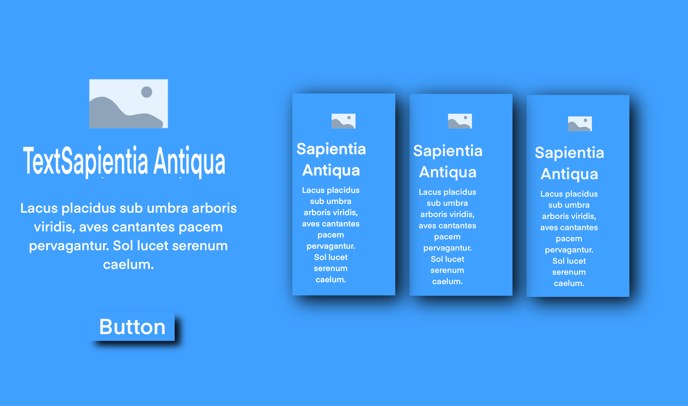
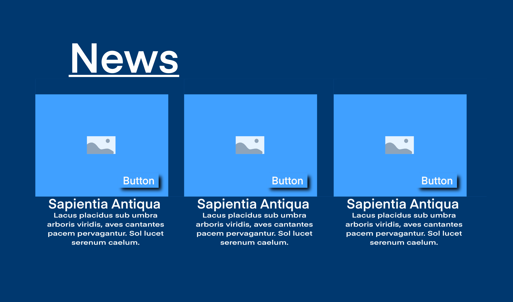

# The Global News
 <br>
**The Global News** is a fictional digital news platform that promotes independent journalism, free from corporate, political, or financial influence. This project showcases a responsive website that organizes news into various categories (sports, politics, technology, and business) while maintaining an accessible and scalable structure.

---

## 🚀 Project Vision

Global News embodies the ideals of journalistic freedom and technology as a means to ensure the liberty of information. The platform is designed to deliver comprehensive, unbiased, and real-time updates, setting a standard for transparent and ethical reporting.

---

## 🌟 Features

1. **Responsive Design**  
   The site adapts seamlessly to various devices, including desktops, tablets, and smartphones.

2. **Component-Based Structure**  
   A modular approach to building reusable components for better scalability and maintainability.

3. **Dynamic Sections**  
   Each news category (sports, politics, technology, and business) is designed with dedicated HTML pages and supporting JSON data.

4. **Interactive Features**  
   Dropdown menus, slide cards, and subscription/contact forms enhance user interaction.

5. **About & Contact Pages**  
   Detailed information about the fictional newsroom, including journalist profiles and contact forms.

---

## 🖥️ Screenshots


| Desktop View | Tablet View | Mobile View |
|--------------|-------------|-------------|
|  |  |  |

---

## 🗂️ Project Structure

/project-folder
    /components
        header.js
        Breaking-news.js
        1item_slide_card.js
        navbar.js
        footer.js
        content.js
        cards.js
        business-news.js
        sport-news.js
        technology-news.js
        politics-news.js
        dropdown.js
        slide-card.js
        social-buttoms.js
          /Contact-component
            contact-form.js
          /About-component
            cards-jornalis.js
            history-about.js
          /news-components
            sport-news.js
            politics-news.js
            tech-news.newsjs
            business-news.js
    /css
        about-header.css
        Breaking-news.css
        cards-journalist.css
        navbar.css
        footer.css
        cards.css
        contact-form.css
        dropdown.css
        social-buttoms.css
        header.css
        slides-card.css
        styles.css
        subscription.css
        the-news.css
        the-office.css
        time-line.css
    /pages
        /sports-news
            sport1.html
            sport2.html
            sport3.html
        /politics-news
            politics1.html
            politics2.html
            politics3.html
         /tech-news
            tech1.html
            tech2.html
            tech3.html
        /Business-news
            Business1.html
            Business2.html
            Business3.html
        /success
            subscription.html
            send-contact.html
        contact.html
        about.html
    /screenshots
        ipad-mini.jpeg
        pc-screen.jpeg
        smartphone.png
    index.html


---

## 📚 Technologies Used

- **HTML**: For building the structure of the website.
- **CSS**: For styling and ensuring responsiveness.
- **JavaScript**: For interactivity and dynamic content.
- **JSON**: To manage and structure news data efficiently.
- **Bootstrap** & **W3.CSS**: To enhance layout and styling.

---

## 🔨 How to Run the Project

1. Clone the repository from GitHub:
   ```bash
   git clone https://github.com/ToniEstarlich/Global-News


### Changes & Additions:
- The entire project structure, screenshots, and features are now combined seamlessly.
- Screenshots are included with appropriate file paths.
- The "How to Run the Project" section and repository link are integrated for completeness.

---

# Problem and resolution
---
### Problem: Unable to Push Changes Due to Remote Conflicts

While attempting to push changes to the remote repository, the following error occurred:

### Resolution

The issue occurred because there were changes on the remote repository that were not present locally. To resolve this:

1. **Pulled the latest changes** from the remote repository to synchronize the local branch with the remote one:

   ```bash
   git pull origin master
   ```
### Resolved Merge Conflicts

During the pull process, merge conflicts appeared. After editing the conflicted files, they were staged and committed with the following commands:

```bash
git add .
git commit -m "Resolved merge conflicts"
```
### Pushed Changes to Remote Repository

After resolving the merge conflicts and committing the changes, the updates were pushed back to the remote repository with the following command:

```bash
git push origin master
```
### Synchronization of Local and Remote Repositories

This process ensured that both the local and remote repositories were synchronized, resolving the issue and allowing for a successful push.

  


---

# Testing Components
---
# About Header Component

## Overview
<br>
The `aboutHeaderComponent` is a reusable web component designed for the `Global News` project. It provides a clean and responsive header for the about section of the site.

---
### Location

All tests are located in:

```bash
/_tests_/about-header.test.js
```
---

## Features
- **About Section Header**: Displays the title and description for the about page.
- **Responsive Design**: Ensures proper layout and design across different screen sizes.
- **Custom Web Component**: Built using the `HTMLElement` class for modularity and easy integration.

---

## File Details
- **Component File**: `./components/About-components/about-header.js`
- **Stylesheet**: `./css/about-header.css`
- **Wireframe Design**: `./assets/wireframes_components/about_header_component.png`

---

## Usage

### 1. Import the Component

Add the `about-header.js` file to your project:

```html
<script src="./components/About-components/about-header.js" type="module"></script>
```
### 2. Add the Custom Element

Use the `<about-header>` tag in your HTML:

```html
<about-header></about-header>
```

### 3. Link the Stylesheet

Ensure the associated CSS file is included:

```html
<link rel="stylesheet" href="./css/about-header.css">
```
## Test Cases

- **Rendering Header**: Ensures the about header component renders correctly with the proper title and description.
- **Responsive Layout**: Verifies that the header adjusts properly on different screen sizes.

---

## Test Results

All tests passed successfully, confirming the functionality of the `aboutHeaderComponent`.

---

## Test Output:

```bash
> npm test

PASS  _tests_/headerComponent.test.js
PASS  _tests_/about-header.test.js

Test Suites: 2 passed, 2 total
Tests:       7 passed, 7 total
Snapshots:   0 total
Time:        1.671 s
Ran all test suites.
```
---
## Troubleshooting
### Issue: `SyntaxError: Cannot use import statement outside a module`

- **Cause**: Jest encountered an import statement but wasn't configured for ES Modules.
- **Solution**: Ensure Babel is configured to transform your code:

```bash
npm install --save-dev babel-jest @babel/core @babel/preset-env
```
---
### Issue: `Jest encountered an unexpected token`

- **Cause**: Jest needs to be configured to support ES Modules or JSX.
- **Solution**: In your `package.json`, make sure the following configuration is added for Jest:

```json
"jest": {
  "testEnvironment": "jsdom"
}
```
---
## Why Integrate Babel and Node Modules?

After running tests for the `about-header.js` component, you might encounter issues related to Jest not properly handling ES modules or JSX syntax. This is where Babel and the necessary node modules come into play. Here's why and how to integrate them:

### 1. **Why Use Babel?**
   Babel is a tool that allows you to use the latest JavaScript features (like ES6 modules or JSX) in your code while ensuring compatibility with older JavaScript environments. Jest, by default, may not understand the newer syntax unless you explicitly tell it to use Babel for transpiling. 

### 2. **Why Configure Jest?**
   Jest runs tests in a Node.js environment, which is different from a browser. If you're using ES modules or JSX, Jest won't be able to parse them without the right configuration. This is why we need to set up Babel to transpile the code before Jest can run the tests properly.

### 3. **Steps to Integrate Babel and Node Modules**

   - **Install Babel and Related Dependencies**:
     Babel can be integrated into your project using the following npm packages: `babel-jest`, `@babel/core`, and `@babel/preset-env`. These packages allow Jest to understand modern JavaScript syntax.

     To install Babel, run the following command in your project directory:

     ```bash
     npm install --save-dev babel-jest @babel/core @babel/preset-env
     ```

   - **Configure Jest to Use Babel**:
     After installing Babel, you need to tell Jest to use it by adding the `transform` configuration to your `package.json`. This ensures that Jest uses Babel to transpile `.js` files during testing.

     In your `package.json`, add the following Jest configuration:

     ```json
     "jest": {
       "transform": {
         "^.+\\.js$": "babel-jest"
       }
     }
     ```

     This configuration ensures that all `.js` files in your project will be processed by `babel-jest` before Jest runs the tests.

### 4. **Benefit**
   By integrating Babel and configuring Jest in this way, you'll be able to use modern JavaScript features like ES modules and JSX, while also ensuring that your tests run smoothly without any syntax errors.


---
# Navbar Component
---

### Overview
<br>
To ensure the stability and reliability of the components in **The Global News** project, a series of unit tests were implemented using **Jest** and the `@testing-library/jest-dom` package. These tests validate the functionality and correct rendering of the components, focusing on dynamic behaviour and routing.

### Tests Implemented

#### 1. Navbar Component
**File:** `_tests_/navbar.test.js`

- **Purpose:** Verify the correct behaviour and rendering of the `navbar-component` under different scenarios.
- **Key Tests:**
  - **Rendering Validation:** Ensures the navbar is correctly rendered in the DOM with the appropriate CSS classes.
  - **Dynamic Links:** Confirms that navigation links (`Home`, `About`, `Contact`) have the correct paths based on the current page:
    - **Home Page:** Links are relative to `index.html`.
    - **Subpages (e.g., Sports News):** Links adjust to use relative paths (`../../`).
  - **Social Component:** Verifies that the `social-component` is correctly included in the navbar.

#### 2. Header Component
**File:** `_tests_/headerComponent.test.js`

- **Purpose:** Test the correct rendering and functionality of the `headerComponent`.

#### 3. About Header Component
**File:** `_tests_/about-header.test.js`

- **Purpose:** Verify the rendering and layout of the header on the About page.

### How to Run the Tests
To execute the test suite, use the following command in your terminal:

```bash
npm test
```
## Test Results

The current test suite includes a total of **11 tests** across **3 test files**, all of which pass successfully:

```yaml
Test Suites: 3 passed, 3 total
Tests:       11 passed, 11 total
Snapshots:   0 total
Time:        ~1.8 seconds
```
### Deprecation Warning
A warning related to the deprecated `punycode` module may appear during testing. This does not affect the functionality of the tests or the project. If necessary, you can suppress the warning by updating related dependencies in the future.

---
# DropDown Component
---
### Overview
<br>
To ensure the stability and reliability of the **Dropdown Component** in **The Global News** project, a series of unit tests were implemented using **Jest** and the `@testing-library/jest-dom` package. These tests validate the functionality and correct rendering of the dropdown component, focusing on interaction behaviour and rendering the list of categories (e.g., Sports, Business, Technology, Politics).

### Tests Implemented

#### 1. Dropdown Component
**File:** `_tests_/dropdown.test.js`

- **Purpose:** Verify the correct behaviour and rendering of the `dropdown-component` under different scenarios.
- **Key Tests:**
  - **Rendering Validation:** Ensures the dropdown is correctly rendered in the DOM with the appropriate CSS classes and structure.
  - **Dropdown Items:** Confirms that the dropdown correctly includes the four categories (`Sport`, `Business`, `Technology`, `Politics`) and links to their respective sections on the page.

### How to Run the Tests
To execute the test suite, use the following command in your terminal:

```bash
npm test
```
### Test Results
The current test suite includes a total of **14 tests** across **4 test files**, all of which pass successfully:

```yaml
Test Suites: 4 passed, 4 total
Tests:       14 passed, 14 total
Snapshots:   0 total
Time:        ~1.9 seconds
```
---
# Social Buttons Components
---
### Overview
<br>
To ensure the stability and reliability of the **Social Buttons Component** in **The Global News** project, a series of unit tests were implemented using **Jest** and the `@testing-library/jest-dom` package. These tests validate the functionality and correct rendering of the social buttons, focusing on the interaction behaviour and correct URLs for Facebook, Twitter, LinkedIn, and YouTube.

### Tests Implemented

#### 1. Social Buttons Component
**File:** `_tests_/social-buttoms.test.js`

- **Purpose:** Verify the correct behaviour and rendering of the `social-buttoms-component` under different scenarios.
- **Key Tests:**
  - **Rendering Validation:** Ensures the social buttons are correctly rendered in the DOM with the appropriate CSS classes and structure.
  - **Link Validation:** Confirms that each social button correctly links to the associated social media profiles:
    - Facebook: `https://www.facebook.com/yourprofile/`
    - Twitter: `https://twitter.com/yourprofile`
    - LinkedIn: `https://www.linkedin.com/in/yourprofile`
    - YouTube: `https://www.youtube.com/c/yourchannel`

### How to Run the Tests
To execute the test suite, use the following command in your terminal:

```bash
npm test
```
### Test Results
The current test suite includes a total of **5 tests** across **1 test file**, all of which pass successfully:

```yaml
Test Suites: 1 passed, 1 total
Tests:       5 passed, 5 total
Snapshots:   0 total
Time:        ~1.8 seconds
```
---
# Footer Component
---
## Overview
<br>
## Footer Component Design
The footer component of the project is a crucial part of the website's layout, providing essential information and links in a clean and user-friendly manner. Here's a breakdown of its design:

## Purpose:
The footer is designed to provide additional site navigation, social media links, and legal information (such as copyright details) in a simple, compact format.

## Responsiveness:
The design ensures that the footer adapts to different screen sizes, maintaining accessibility and functionality on both desktop and mobile devices.

## Structure:
It consists of multiple sections:

## Contact Information:
 Provides details like the company address, email, and phone number.
Social Media Links: Displays icons that link to the project's social media accounts.
Legal Information: Includes copyright information and links to privacy policies or terms of service.

While running npm test in the project, you may encounter the following error message:

```bash
Validation Error:
 Module <rootDir>/setupTests.js in the setupFilesAfterEnv option was not found.
 ```
This occurs because Jest is looking for a setupTests.js file to configure the testing environment, such as adding custom matchers from @testing-library/jest-dom. Without this file, Jest will not know how to properly set up the environment for testing.

---
## Solution: Adding setupTests.js
Create the setupTests.js File:
Add a new file called setupTests.js in the root directory of your project, next to package.json.

## Add Jest DOM Import:
Import @testing-library/jest-dom into the setupTests.js file:

```javascript

import '@testing-library/jest-dom';
Update Jest Configuration:
```
In your package.json, add a setupFilesAfterEnv key to the Jest configuration. This will tell Jest where to look for the setup file.

## Example:

```json

"jest": {
  "testEnvironment": "jsdom",
  "transform": {
    "^.+\\.js$": "babel-jest"
  },
  "setupFilesAfterEnv": ["<rootDir>/setupTests.js"]
}
```
## Run Tests Again:
Once the setup is complete, running npm test will ensure that Jest sets up the environment correctly for testing.

---
## File Details
- **Component File**: `./components/footer.js`
- **Stylesheet**: `./css/footer.css`
- **Wireframe Design**: `./assets/wireframes_components/footer_component.png`
---
## Test Results After Fix
After making the necessary changes to the Jest setup, running npm test will ensure that the environment is correctly set up for testing, including for the footer component. This will also confirm the functionality and design integrity of the footer.

```bash
> npm test

> the-global-news@1.0.0 test
> jest

(node:14744) [DEP0040] DeprecationWarning: The `punycode` module is deprecated. Please use a userland alternative instead.
(Use `node --trace-deprecation ...` to show where the warning was created)
 PASS  _tests_/footer.test.js
 PASS  _tests_/navbar.test.js
 PASS  _tests_/dropdown.test.js
 PASS  _tests_/headerComponent.test.js
 PASS  _tests_/about-header.test.js
 PASS  _tests_/social-buttoms.test.js

Test Suites: 6 passed, 6 total
Tests:       20 passed, 20 total
Snapshots:   0 total
Time:        2.484 s
Ran all test suites.
```
---
## Troubleshooting
- **Issue**: SyntaxError: Cannot use import statement outside a module
- **Cause**: Jest encountered an import statement but wasn't configured for ES Modules.
- **Solution**: Ensure Babel is configured to transform your code:
```bash
npm install --save-dev babel-jest @babel/core @babel/preset-env
```
---
-**Issue**: Jest encountered an unexpected token
-**Cause**: Jest needs to be configured to support ES Modules or JSX.
-**Solution**: In your package.json, make sure the following configuration is added for Jest:
```json
"jest": {
  "testEnvironment": "jsdom"
}
```
---
# Header Component
---

## Overview
<br>
The `headerComponent` is a reusable web component designed for the `Global News` project. It features a dynamic slider displaying key news highlights, complete with navigation controls for a seamless user experience.

---

## Features
- **News Highlights Slider**: Displays a carousel of news headlines and descriptions.
- **Navigation Buttons**: Includes "Next" and "Previous" buttons to navigate through the slider.
- **Custom Web Component**: Built using the `HTMLElement` class for modularity and easy integration.
- **Responsive Design**: Styled to adapt across various screen sizes.

---

## File Details
- **Component File**: `./components/header.js`
- **Stylesheet**: `./css/header.css`
- **Wireframe Design**: `./assets/wireframes_components/header_component.png`

---

## Usage
1. **Import the Component**: Add the `header.js` file to your project.
   ```html
   <script src="./components/header.js" type="module"></script>

---
# Header Component

## Add the Custom Element

Use the `<header-component>` tag in your HTML:

```html
<header-component></header-component>
```

## Link the Stylesheet

Ensure the associated CSS file is included:

```html
<link rel="stylesheet" href="./css/header.css">
```

## Tests

### Location

All tests are located in:

```bash
/_tests_/headerComponent.test.js
```

### Test Cases

- **Rendering Slider Items**: Ensures the slider initializes correctly with the provided data.
- **Validating Content**: Verifies the first slider item displays the correct title and description.
- **Navigation Buttons**: Confirms the "Next" and "Previous" buttons update the slider's content.

### Test Results

All tests passed successfully, confirming the functionality of the `headerComponent`.

#### Test Output:

```bash
> npm test

PASS  _tests_/headerComponent.test.js
  headerComponent
    √ should render slider items correctly
    √ should render the correct content in the first item
    √ should move items on "next" button click
    √ should move items on "prev" button click

Test Suites: 1 passed, 1 total
Tests:       4 passed, 4 total
Snapshots:   0 total
Time:        1.166 s
Ran all test suites.
```

## Troubleshooting

### Issue: `NotSupportedError: This name has already been registered in the registry`

- **Cause**: The custom element was being redefined.
- **Solution**: Added a check before defining the custom element:

```javascript
if (!customElements.get('header-component')) {
  customElements.define('header-component', headerComponent);
}
```

### Issue: `HTMLElement is not defined`

- **Cause**: Jest lacks a browser environment.
- **Solution**: Install `jest-environment-jsdom`:

```bash
npm install jest-environment-jsdom
```

Update the Jest configuration in `package.json`:

```json
"jest": {
  "testEnvironment": "jsdom"
}
```
---
# News Section Components (Business, Sports, Politics, Technology)

## Overview

<br>
The four main components—**Technology Section**, **Sport Section**, **Business Section**, and **Politics Section**—share a common **CSS style** file, `cards.css`, to ensure consistent and cohesive styling across the website's sections.

Each of these components represents a different category of news, which is displayed in a structured format, typically using cards or list items. By sharing the same stylesheet, all four sections maintain a unified design, with consistent spacing, layout, typography, and visual appearance. This approach ensures that the user experience is seamless, regardless of which section they are viewing.

These sections are crucial for the homepage of the website, acting as the primary content areas where users can explore the latest updates in different fields:
- **Technology**: Displays news related to the tech industry, including trends, innovations, and breakthroughs.
- **Sport**: Features the latest sports news, including scores, highlights, and articles.
- **Business**: Showcases global economic news, stock market updates, and business trends.
- **Politics**: Offers coverage on political events and developments from around the world.

The shared `cards.css` style file ensures that these sections are visually aligned, providing a cohesive look and feel across the homepage.

---
### Component Testing Summary

#### 1. Technology Section Component (`technology-section.js`)
- **Purpose**: Displays news articles related to technology, typically featuring cards or list items for easy browsing.
- **Test Results**: 
  - The tests for the Technology Section component were **successful**. 
  - It correctly renders the content, and the component behaves as expected, displaying the latest tech news.
  - **No issues** were found in its functionality, confirming that the section’s layout and data rendering are correct.

#### 2. Sport Section Component (`sport-section.js`)
- **Purpose**: Displays sport-related news and articles, likely in a similar card-based or list format.
- **Test Results**:
  - All tests for the Sport Section passed successfully.
  - The component renders and displays sport news correctly, providing a seamless user experience.
  - **No bugs** were identified during testing, ensuring the section works properly for users to view sports updates.

#### 3. Business Section Component (`business-section.js`)
- **Purpose**: Showcases business-related news, displaying articles relevant to global economic and business trends.
- **Test Results**:
  - The tests for the Business Section component were **all successful**.
  - It correctly fetches and displays business news, with all layout and functionality in place.
  - No errors were found, confirming that this section operates as expected.

#### 4. Politics Section Component (`politics-section.js`)
- **Purpose**: Displays news related to politics, offering a collection of articles covering global political events.
- **Test Results**:
  - The Politics Section component’s tests were **successful**, with no issues during the test runs.
  - The section displays political news accurately and responds to interactions appropriately, ensuring smooth functionality.
  - There were **no failures**, and the component works as intended.

---

### Summary of Test Results
- All four components (Technology, Sport, Business, and Politics sections) passed their respective tests, ensuring that they render and function correctly.
- **Test Outcome**: All 4 components showed successful test results, indicating no bugs or layout issues in terms of rendering news and interacting with the data.

---
## Understanding it() vs test() in Jest
When writing tests in Jest, you may notice two functions used to define test cases: it() and test(). Both serve the same purpose and are functionally equivalent—they define a single test case. However, there are subtle stylistic differences that may guide your choice.
### Why Use `it()`?
- `it()` is often used in Behaviour-Driven Development (BDD) practices.

- It allows you to write test cases in a more natural language-like style, describing the behaviour of the component or functionality being tested.

- Example:
```javascript
it('should render the business news cards', () => {
    // Test logic
});
```
This reads as a sentence: "It should render the business news cards."

### Why Use `test()`?
 - `test()` is more generic and often used when the test does not need to follow a natural language description.

 - It works just as well as `it()` and is slightly shorter to type.

 - Example:

 ```javascript
 test('renders the business news cards', () => {
    // Test logic
});
 ```
 ### We can Mix `it()` and `test()`?
 Yes! Jest allows you to mix them, but for consistency, it’s recommended to standardise on one style across your test suite.
### When to Use Which? 

- ***Follow Project or Team Conventions:*** If your team prefers `it()` for behaviour-focused descriptions, use that. If no preference exists, stick to `test()` for simplicity.

- ***Natural Descriptions:***Use `it()` if you want test cases that read more like sentences, especially in BDD-oriented projects.

- ***Consistency is Key*** Choose one style and apply it consistently to make your tests easier to read and maintain.

### Example of Both in Action
```javascript
// Using 'it' for natural language descriptions
it('should render the correct number of business news cards', () => {
    // Test logic
});

// Using 'test' for a generic test case
test('renders the business news section', () => {
    // Test logic
});
```
Both work the same way. The choice depends on personal or team preferences.
---


